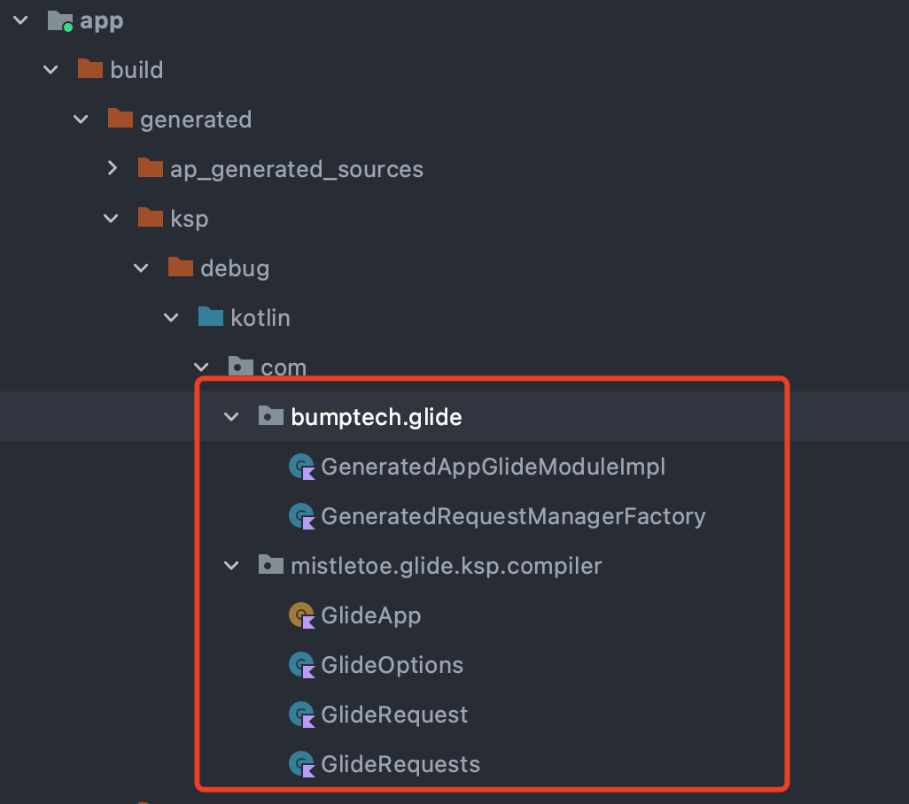

# glide-ksp [](https://search.maven.org/search?q=g:io.github.mistletoe5215%20AND%20a:glide-ksp%20AND%20v:1.0.0)

> glide's kotlin annotation processor,use kotlin symbol processor(ksp)

### requirements
|library|version|
|:----:|:----:|
|kotlin| >= `1.6.21`|
|ksp| `1.6.21-1.0.5`|

### usage

- add mavenCentral repository to repositories

```groovy
//in root build.gradle
allprojects {
    repositories {
        google()
        jcenter()
        mavenCentral()
    }
}

```

- import kotlin symbol processor plugin

```groovy
    // in root build.gradle
   plugins {
    id 'com.google.devtools.ksp' version "1.6.21-1.0.5" apply false
   }

```
 - apply kotlin symbol processor plugin in your modules which needs glide's annotation processor

```groovy
   // for example,my demo's application module uses glide's annotation processor
   plugins {
       //...
       id 'com.google.devtools.ksp'
   }
   //add ksp generated class path into sourceSets
   android {
       //...
       sourceSets {
           main {
               java.srcDirs += ['build/generated/ksp']
           }
       }
   }
   //add `glide-ksp` using ksp 
   dependencies {
       ksp "io.github.mistletoe5215:glide-ksp:1.0.0"
   }
   

```
 -  find classes  with `@GlideModule`/`@GlideExtension` in previous uploaded open source library module

 > use ksp `options` to  mark the custom LibraryGlideModules; in java annotation processor/`kapt` these classes  can be found using `RoundEnvironment` to find class  with `@GlideModule` annotation;
 > but now in ksp ,we can't find these classes with using ksp's `Resolver` or `SymbolProcessorEnvironment`.see [issue in ksp](https://github.com/google/ksp/issues/131)
 > therefore,i can only put these class qualifiedNames into ksp compile args to solve it(so stupid ( :(,any one can help me plz push request)
 > they're splited by "|" separator,use key named `GlideModule`
 > the custom LibraryGlideExtensions,as well,use key named `GlideExtension`
 
```groovy
    //in application's build.gradle convention scope
   ksp {
       arg( "GlideModule","com.bumptech.glide.integration.okhttp3.OkHttpLibraryGlideModule")
   }

```

 - find classes  with `@GlideModule`/`@GlideExtension` in new library module which has created `com.bumptech.glide.ksp` directory 

 > put the module's LibraryGlideModule Impl class under `com.bumptech.glide.ksp` directory ,it can be found and registered automatically
 

### check whether Glide-KSP proceed successfully

 - make sure the necessary classes are generated ,they are `GeneratedAppGlideModuleImpl`,`GeneratedRequestManagerFactory`,`GlideApp`,`GlideOption`,`GlideRequest`,`GlideRequests`



 - then,call Glide's init in Application,set break points in `GeneratedAppGlideModuleImpl`,run app as  debug mode to see whether it will block in these break points
   
 - finally,see whether it keeps functioning properly,load image successfully as usual
